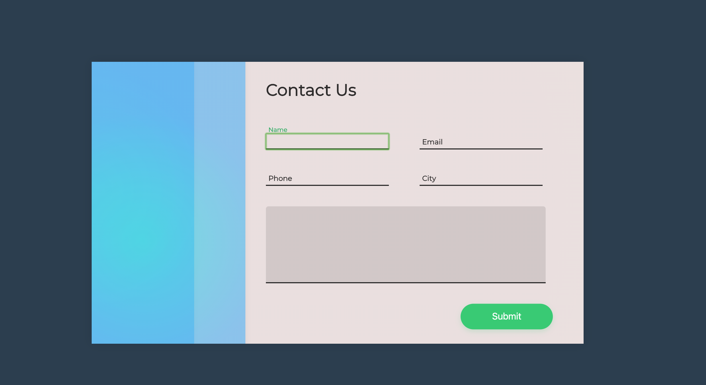

# php-contact-form
### Contact form

## Error message

This a contact form using php as backend language.
This contact form also have nice css styles, and javascript animation.
In this form, you need to fill out the information and php code will check the validation of your information.
If all the informations are correct, it will send the email to the owner .

## To create this form, i used :
1. html
1. sass
1. javascript
1. php
1. php composer
1. phpmailer

## What do i learn 
1. PHP only runs whenever the browser makes a request to the backend server, that will result in some HTML page which is sent to the browser, other than that, nothing "dynamic" happens
it's the combination of the above flow with the javascript.
If you would create something that would validate the data the user is filling in with javascript
the backend would still have to validate it when the  form is submitted and a  POST request is made by the browser. The backend doesnt know what's going on in the user's browser.
1. Gitignore to portect the sensitive information, such like email username and password;
1. Phpmailer.
1. php class.
